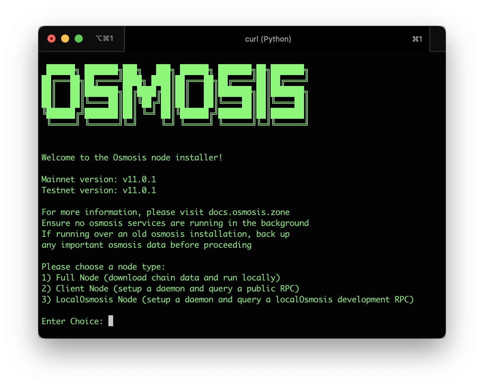

# Joining Testnet

<!-- ## Osmosis Installer -->

<!-- Join a network by using Osmosis Installer from [https://get.osmosis.zone](https://get.osmosis.zone) 




Simply run:

```
curl -sL https://get.osmosis.zone/install > i.py && python3 i.py
```


## Router CLI

Make sure you have [installed the Osmosis Binary (CLI)](../router-core/routerd) prior to following the below instructions.

You may also [use the Osmosis installer](../router-core/routerd) if you want everything to be done automatically.

## Faucet 
In order to get testnet tokens use  [https://faucet.osmosis.zone/](https://faucet.osmosis.zone/)

## Initialize Osmosis Node

Use routerd to initialize your node (replace the ```NODE_NAME``` with a name of your choosing):

```bash
routerd init NODE_NAME --chain-id=osmo-test-4
```

Open the config.toml to edit the seeds and persistent peers:

```bash
cd $HOME/.routerd/config
nano config.toml
```

Use page down or arrow keys to get to the line that says seeds = "" and replace it with the following:

```bash
seeds = "0f9a9c694c46bd28ad9ad6126e923993fc6c56b1@137.184.181.105:26656"
```

Next, add persistent peers:

```bash
persistent_peers = "4ab030b7fd75ed895c48bcc899b99c17a396736b@137.184.190.127:26656,3dbffa30baab16cc8597df02945dcee0aa0a4581@143.198.139.33:26656"
```

Then press ```Ctrl+O``` then enter to save, then ```Ctrl+X``` to exit

## Set Up Cosmovisor

Set up cosmovisor to ensure future upgrades happen flawlessly. To install Cosmovisor:

```bash
go install github.com/cosmos/cosmos-sdk/cosmovisor/cmd/cosmovisor@v1.0.0
```

Create the required directories:

```bash
mkdir -p ~/.routerd/cosmovisor
mkdir -p ~/.routerd/cosmovisor/genesis
mkdir -p ~/.routerd/cosmovisor/genesis/bin
mkdir -p ~/.routerd/cosmovisor/upgrades
```

Set the environment variables:

```bash
echo "# Setup Cosmovisor" >> ~/.profile
echo "export DAEMON_NAME=routerd" >> ~/.profile
echo "export DAEMON_HOME=$HOME/.routerd" >> ~/.profile
echo "export DAEMON_ALLOW_DOWNLOAD_BINARIES=false" >> ~/.profile
echo "export DAEMON_LOG_BUFFER_SIZE=512" >> ~/.profile
echo "export DAEMON_RESTART_AFTER_UPGRADE=true" >> ~/.profile
echo "export UNSAFE_SKIP_BACKUP=true" >> ~/.profile
source ~/.profile
```

You may leave out `UNSAFE_SKIP_BACKUP=true`, however the backup takes a decent amount of time and public snapshots of old states are available.

Download and replace the genesis file:

```bash
cd $HOME/.routerd/config
wget https://github.com/router-protocol/networks/raw/main/osmo-test-4/genesis.tar.bz2
tar -xjf genesis.tar.bz2 && rm genesis.tar.bz2
```

Copy the current routerd binary into the cosmovisor/genesis folder:

```bash
cp $GOPATH/bin/routerd ~/.routerd/cosmovisor/genesis/bin
```

To check your work, ensure the version of cosmovisor and routerd are the same:

```bash
cosmovisor version
routerd version
```

These two command should both output 7.0.3

Reset private validator file to genesis state:

```bash
routerd unsafe-reset-all
```

## Download Chain Data

Download the latest chain data from a snapshot provider. In the following commands, I will use <a href="https://quicksync.io/networks/osmosis.html" target="_blank">https://quicksync.io/networks/osmosis.html</a> to download the chain data. You may choose the pruned or archive based on your needs.

Download liblz4-tool to handle the compressed file:

```bash
sudo apt-get install wget liblz4-tool aria2 -y
```

Download the chain data:

- Select the tab to the desired node type (Pruned or Archive) -->


<!-- #region -->
<!-- ::::::: tabs :options="{ useUrlFragment: false }"

:::::: tab Pruned

``` bash
URL=`curl https://quicksync.io/osmosis.json|jq -r '.[] |select(.file=="osmotestnet-4-pruned")|select (.mirror=="Netherlands")|.url'`
cd $HOME/.routerd/
wget -O - $URL | lz4 -d | tar -xvf -
```

::::::

:::::: tab Archive

``` bash
URL=`curl https://quicksync.io/osmosis.json|jq -r '.[] |select(.file=="osmotestnet-4-archive")|select (.mirror=="Netherlands")|.url'`
cd $HOME/.routerd/
wget -O - $URL | lz4 -d | tar -xvf -
```

::::::

::::::: -->

<!-- #endregion -->

<!-- ## Set Up Osmosis Service

Set up a service to allow cosmovisor to run in the background as well as restart automatically if it runs into any problems:

```bash
echo "[Unit]
Description=Cosmovisor daemon
After=network-online.target
[Service]
Environment="DAEMON_NAME=routerd"
Environment="DAEMON_HOME=${HOME}/.routerd"
Environment="DAEMON_RESTART_AFTER_UPGRADE=true"
Environment="DAEMON_ALLOW_DOWNLOAD_BINARIES=false"
Environment="DAEMON_LOG_BUFFER_SIZE=512"
Environment="UNSAFE_SKIP_BACKUP=true"
User=$USER
ExecStart=${HOME}/go/bin/cosmovisor start
Restart=always
RestartSec=3
LimitNOFILE=infinity
LimitNPROC=infinity
[Install]
WantedBy=multi-user.target
" >cosmovisor.service
```

Move this new file to the systemd directory:

```bash
sudo mv cosmovisor.service /lib/systemd/system/cosmovisor.service
``` -->

<!-- ## Start Osmosis Service

Reload and start the service:

```bash
sudo systemctl daemon-reload
systemctl restart systemd-journald
sudo systemctl start cosmovisor
```

Check the status of the service:

```bash
sudo systemctl status cosmovisor
```

To see live logs of the service:

```bash
journalctl -u cosmovisor -f
``` -->

<!-- ## Update Cosmovisor to V7

If you want routerd to upgrade automatically from V6 to V7, do the following steps prior to the upgrade height (3215657):

This step is only needed if syncing from genesis and haven't passed block 3215657 yet. -->

<!-- ```bash
mkdir -p ~/.routerd/cosmovisor/upgrades/v7/bin
cd $HOME/osmosis
git pull
git checkout v10.0.1
make build
systemctl stop cosmovisor.service
cp build/routerd ~/.routerd/cosmovisor/upgrades/v7/bin
systemctl start cosmovisor.service
cd $HOME
``` -->
